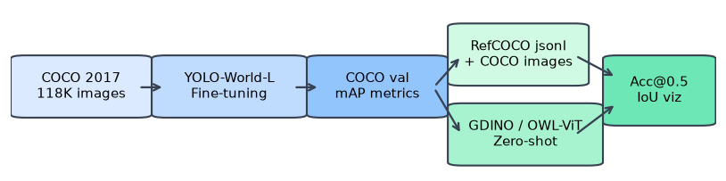
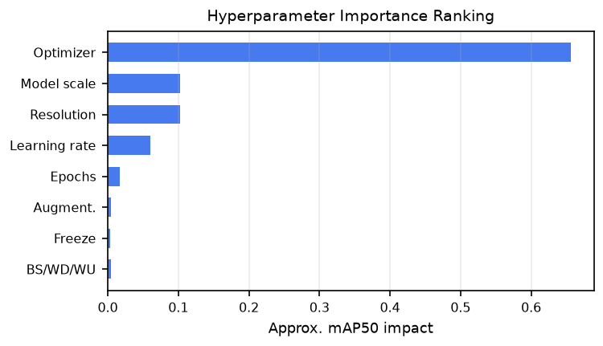
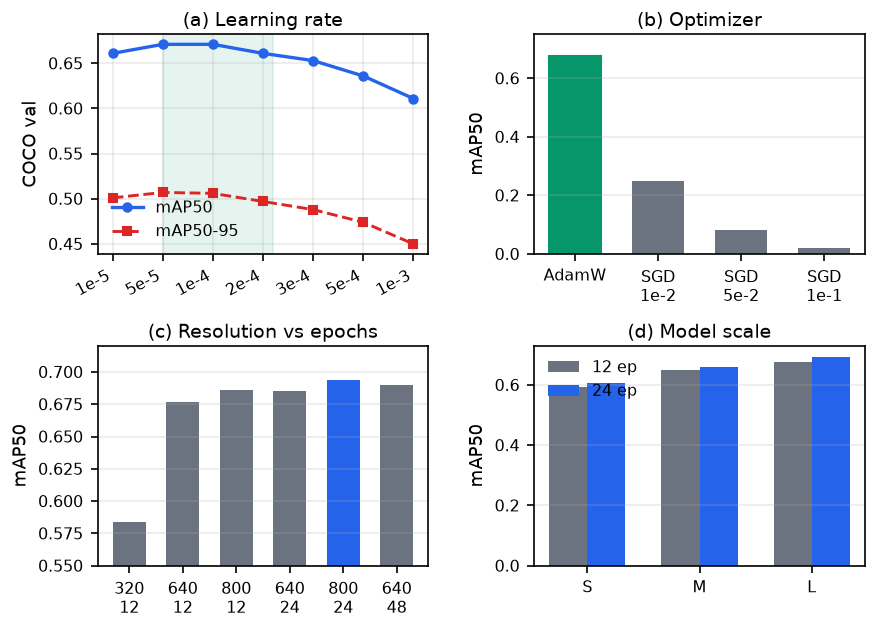
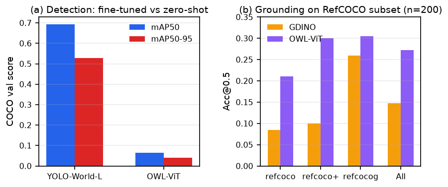
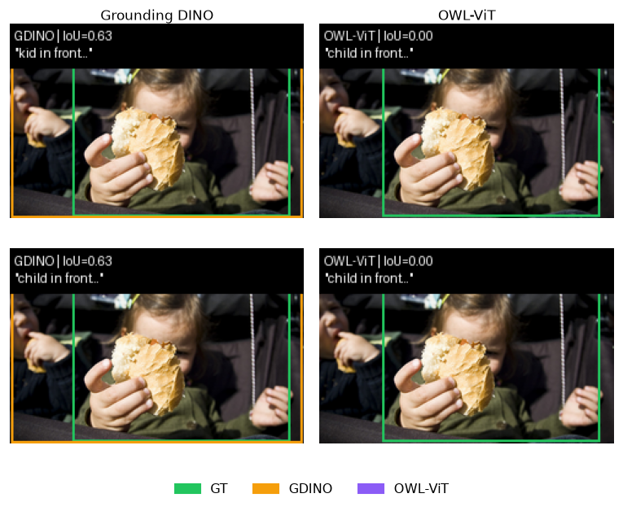

**Student Name:** 纪子越, 施皓天, 孙如琦, 黎子涵  
**Student ID:** 12410416, 12312214, 12412620, 12213030

---

## 1. Introduction

开放词汇目标检测（Open-Vocabulary Object Detection, OVD）突破了传统检测器依赖固定类别表的局限，允许模型根据任意文本描述（如"红色背包"或"戴帽子的人"）来识别物体。与之密切相关的**视觉定位**（Visual Grounding，又称指代表达理解）则更进一步：给定一句自然语言描述（如"左边打伞的人"），模型需在图像中精确定位对应目标并输出边界框。两类任务都依赖视觉与语言的联合理解，是迈向通用交互式视觉系统的重要基础。

然而，现有方法各有局限。传统闭集检测器在已知类别上精度较高，但面对新类别无能为力；OWL-ViT [@minderer2022owlvit] 等零样本检测模型虽支持文本查询，却在 COCO 等密集检测场景下精度明显偏低；Grounding DINO [@liu2023groundingdino] 擅长短语级定位，但推理开销相对较大。如何在**单卡算力限制**下，系统评估 YOLO-World [@cheng2024yoloworld] 等高效 OVD 框架对训练配置的敏感程度，并比较不同零样本定位模型在标准 RefCOCO 系列基准 [@yu2016refcoco; @mao2016refcoco_plus; @nagaraja2016refcocog] 上的表现，正是本项目的出发点。

本项目对应 **Topic 4：Open-Vocabulary Object Detection and Visual Grounding**，包含两条独立但互补的实验路线：

1. **YOLO-World-L 的复现与超参数研究**：在 COCO 2017 上系统开展 35 组对照实验（约 170 GPU 小时），覆盖学习率、优化器、输入分辨率、训练轮数、模型规模、数据增强和骨干冻结等 8 个以上维度。
2. **RefCOCO 子集零样本定位评估**：受集群调度故障影响，在本地 Mac 上完成 Grounding DINO 与 OWL-ViT 的定位评估（每个数据集 200 条样本，共 600 条/模型），验证评估流水线并对比两种模型的差异。

我们重点关注两个核心问题：（i）在 COCO 118K 规模的微调中，哪些训练配置对检测性能有实质影响；（ii）零样本定位模型在不同 RefCOCO 变体上的优劣差异及典型失败模式。与只报告单一基准数值的工作不同，本项目更注重**实证分析的可解释性**和**评估代码的可复现性**。

{width=78%}

*图 1. 项目整体流程：左侧为 COCO 上的 YOLO-World 微调检测，右侧为 RefCOCO 子集上的零样本定位评估。*

---

## 2. Related Works

**开放词汇目标检测。** YOLO-World [@cheng2024yoloworld] 将 CLIP 风格的文本编码器嵌入 YOLOv8 检测骨干，在保留 YOLO 系列实时推理能力的同时支持文本条件检测。其预训练权重已完成大规模视觉-语言对齐，因此 COCO 微调阶段主要是调整检测头的类别对应关系，无需从头学习视觉语义。OWL-ViT [@minderer2022owlvit] 则以 ViT 图像编码器为基础，通过对比学习在块级别（patch level）实现零样本检测，适合开放查询场景，但在 COCO 全类密集检测上的 mAP 通常偏低。

**视觉定位与 Grounding DINO。** Grounding DINO [@liu2023groundingdino] 在 DETR 系列检测器 [@carion2020detr] 的基础上引入跨模态特征融合模块，并通过大规模短语定位预训练获得强大的开放集定位能力。与 YOLO-World "检测 + 文本提示" 的范式不同，Grounding DINO 天然面向"图像 + 句子 → 边界框"的指代任务，与 RefCOCO 评估更为契合。

**RefCOCO 系列基准。** RefCOCO [@yu2016refcoco] 包含大量日常口语化的指代表达；RefCOCO+ [@mao2016refcoco_plus] 禁止使用绝对位置词（如 left/right），要求模型仅依赖外观和相对关系进行定位；RefCOCOg [@nagaraja2016refcocog] 的表达更长、更复杂，更接近自然对话风格。三者难度依次递增，共同构成视觉定位研究的标准评测套件。

**与本项目的关联。** 已有工作通常以全量验证集上的最优性能为目标，鲜少关注单卡约束下的训练过程细节。本项目在此方向上进行精细化消融，同时搭建轻量化定位评估流水线，在集群资源受限时也能对零样本模型进行公平比较。

---

## 3. Method

本项目不提出新模型，而是对现有方法进行复现、系统扫描和分析。

### 3.1 YOLO-World-L 微调

我们基于 Ultralytics 框架 [@ultralytics2024yolo] 在 COCO 2017 [@lin2014coco] 上微调 **YOLO-World-L**（预训练权重 `yolov8l-worldv2.pt`）。COCO 的 80 个类别名称以文本提示的形式传入模型，检测头输出对应的边界框与置信度分数。默认优化配置为 AdamW、权重衰减 0.05、预热 1000 步。

超参数研究遵循**分阶段控制变量**的原则：先固定 6 epoch 的短程训练快速扫描学习率（7 个候选值）和优化器（AdamW vs SGD），再逐一消融批次大小、权重衰减、预热步数、输入分辨率（320/640/800px）、训练轮数（24/48 epoch）、模型规模（S/M/L）、四种数据增强设置以及骨干冻结策略。每次实验仅改变被测维度，其余超参均固定为基线配置（lr=5e-5，bs=8，640px），以保证结果的可比性。

### 3.2 零样本定位基线

- **Grounding DINO (base)** [@liu2023groundingdino; @hf2024gdino]：调用 Hugging Face 的 `GroundingDinoForObjectDetection`，对每条指代表达取置信度最高的预测框（top-1），置信度阈值设为 0.25。
- **OWL-ViT (base-patch32)** [@minderer2022owlvit; @hf2024owlvit]：以短语定位模式运行，文本输入截断至 16 个 token（模型硬性限制），阈值 0.1，批次大小为 1。

两个模型均**不在 RefCOCO 上进行微调**，直接以零样本方式推理，从而隔离预训练能力的差异。

### 3.3 统一评估流水线

评估代码包含以下模块：`refcoco_dataset.py`（兼容官方 REFER 格式与 PaDT jsonl 备用格式）、`metrics.py`（计算 IoU、Acc@0.5、Acc@0.75 并导出 JSON 汇总结果），以及分别面向 GDINO 和 OWL-ViT 的 `eval_refcoco.py`。子集采样统一取 PaDT val jsonl 的**前 200 行**，确保两个模型在完全相同的样本上进行比较。

---

## 4. Experiments

### 4.1 数据集

| 数据集 | 用途 | 使用规模 |
|--------|------|---------|
| **COCO 2017** | OVD 微调与验证 | 训练集 118K 张 / 验证集 5K 张，80 类 |
| **RefCOCO / + / g** | 视觉定位（验证子集） | 每个数据集 200 条指代表达 |

定位评估使用 PaDT 提供的 RefCOCO val jsonl，图像来自 COCO 2017（600 条表达共涉及 79 张不重复图片）。三个 RefCOCO 变体的难度依次递增——RefCOCO+ 禁止位置词、RefCOCOg 表达更长——有助于分析模型对不同表达类型的适应能力。

### 4.2 实现细节

**检测实验（服务器 NVIDIA L40 48GB）**

- 框架：Ultralytics 8.4.60，PyTorch 2.5.1+cu121
- 基线配置：学习率 2e-4，AdamW，批次大小 8，分辨率 640px，训练 12 epoch
- 最优配置：学习率 5e-5，AdamW，批次大小 8，分辨率 800px，训练 24 epoch，权重衰减 0.05
- 共完成 35 组实验，累计约 170 GPU 小时；最优 12-epoch 配置重复运行两次，均达到 mAP50=0.677，验证了结果的稳定性

**定位实验（本地 Mac M3，MPS 加速）**

- 运行环境：Python 3.14，PyTorch 2.12，transformers 4.47 及以上版本
- 每个数据集评估 200 条样本；GDINO 约用时 39 分钟，OWL-ViT 约 3 分钟

### 4.3 评估指标

- **目标检测**：COCO 标准指标 mAP50（IoU 阈值 0.50）和 mAP50-95（IoU 0.50 至 0.95 的平均值）
- **视觉定位**：Acc@0.5 / Acc@0.75（预测框与真实框的 IoU 是否达到阈值），以及 mean IoU（top-1 预测框与真实框的平均交并比）

### 4.4 实验设计与结果

#### 4.4.1 YOLO-World 超参数研究

为在约 160 GPU 小时的预算内覆盖 8 个维度，我们对大多数超参采用 **"单因素、短程（6 epoch）扫描"** 策略；分辨率、训练轮数和模型规模的关键结论在 12–24 epoch 的完整训练中进一步确认。图 2 中各超参的影响量级，定义为该维度最优与最差配置之间的 mAP50 差值。

{width=62%}

*图 2. 各超参数对 mAP50 的近似影响量级（基于 35 组对照实验）。*

{width=78%}

*图 3. 主要扫描结果：(a) 学习率，(b) 优化器，(c) 分辨率 vs 训练轮数，(d) 模型规模。*

**学习率。** 图 3(a) 显示，mAP50 在 5e-5 至 2e-4 的范围内形成一个**较宽的性能平台**（6 epoch 时约为 0.661–0.671），说明 YOLO-World 的预训练权重已提供了良好的初始化，微调过程对学习率的选取并不特别敏感。当学习率超过 3e-4 后，性能开始持续下滑（1e-3 时 mAP50 跌至 0.611），这可能是过大的更新步长破坏了 BatchNorm 统计信息和检测头的收敛。最终的 24-epoch 全量训练选用 5e-5，相比默认的 2e-4 基线在 12 epoch 时表现更佳（mAP50 0.677 vs 0.661）。

**优化器。** 如图 3(b) 所示，SGD 在所有测试学习率下均**灾难性地失败**（mAP50 分别为 0.248 / 0.081 / 0.021）。YOLO-World 融合了 BatchNorm 和多尺度特征，不同层之间的梯度尺度差异较大，这恰恰需要 AdamW 的自适应步长来稳定优化；而 SGD 的固定步长在此场景下显然力不从心。这一现象与现代 CNN 检测器普遍选用自适应优化器的经验完全吻合。

**分辨率与训练轮数。** 图 3(c) 的结果清楚地表明，提高输入分辨率比单纯延长训练更有效：800px 训练 12 epoch（mAP50 0.686）的效果已接近 640px 训练 24 epoch（0.685）；即便将 640px 的训练延长至 48 epoch（mAP50 0.690），仍不及 800px 训练 24 epoch（**0.694**）。这是因为更高分辨率有助于检测小目标和精确定位目标边界；而使用 320px 时，mAP50 仅有 0.584，较 640px 低了 0.093。实践建议：**在算力允许的前提下，优先提高输入分辨率，再考虑增加训练轮数。**

**模型规模。** 图 3(d) 表明 L > M > S 的排序在各训练设置下始终稳定：24 epoch 时三者 mAP50 分别为 0.694 / 0.659 / 0.605，L 比 S 高出约 0.09。从 12 epoch 延长至 24 epoch 对三种规模的提升幅度相近（约 +0.01–0.017），说明 S 与 L 之间的差距主要来自模型表达能力的上限，而非训练不充分。

**影响较小的因素。** 批次大小（4/8/16）、权重衰减（1e-5 至 1e-2）和预热步数（0/500/2000）对最终 mAP50 的影响均不超过 0.005，说明在 COCO 118K 的数据规模下，数据本身已提供了充分的隐式正则化。数据增强的消融实验（分别关闭 mosaic、自动增强、随机擦除、缩小缩放比例）合计影响也不足 0.005，其中关闭 mosaic 的损失最大，也仅为 0.004。冻结骨干网络最多损失 0.003 mAP50（800px 下为 0.685 vs 0.686），在需要节省计算资源时是一个几乎无损的加速手段。

| 因素 | 主要发现 | 影响量级（mAP50） |
|------|---------|-----------------|
| 优化器 | SGD 完全失败，必须使用 AdamW | 0.677→0.021 |
| 模型规模 | L > M > S，差距稳定 | ~+0.10 |
| 输入分辨率 | 800px 最优，320px 严重下降 | +0.102 |
| 学习率 | 5e-5–2e-4 为性能平台区 | 最多 +0.06 |
| 训练轮数 | 24 epoch 有一定提升，但效果不及分辨率 | +0.017 |
| 数据增强 / 权重衰减 / 预热 / 批次大小 | 影响极小 | < ±0.005 |
| 冻结骨干 | 几乎无损失，可用于加速 | −0.003 |

**最优结果：mAP50 = 0.694，mAP50-95 = 0.528**（YOLO-World-L，800px，24 epoch，lr=5e-5，AdamW）。

**零样本检测对照。** OWL-ViT 在 COCO val 上的 mAP50 仅为 0.064（mAP50-95 0.040），约为微调后 YOLO-World-L 的 **1/11**。这一对比说明，在 COCO 这类固定类别、实例密集的检测场景下，领域内微调仍然不可或缺；零样本 ViT 检测器更适合用于开放查询或类别泛化场景，而非直接替代经过优化的检测流水线。

#### 4.4.2 RefCOCO 子集定位评估（每数据集 n=200）

由于集群调度系统持续报错（`Invalid qos specification`），本部分评估改在本地 M3 上完成。

{width=76%}

*图 4. (a) COCO 检测：微调 YOLO-World-L 与零样本 OWL-ViT 的性能对比；(b) RefCOCO 子集 Acc@0.5 结果。*

**定量结果（Acc@0.5 / Acc@0.75 / mean IoU）**

| 数据集 | GDINO Acc@0.5 | OWL Acc@0.5 | GDINO Acc@0.75 | OWL Acc@0.75 | GDINO IoU | OWL IoU |
|--------|---------------|-------------|----------------|--------------|-----------|---------|
| refcoco | 0.085 | **0.210** | 0.035 | **0.195** | 0.093 | **0.224** |
| refcoco+ | 0.100 | **0.300** | 0.075 | **0.260** | 0.108 | **0.287** |
| refcocog | 0.260 | **0.305** | 0.230 | **0.270** | 0.275 | **0.322** |
| **总体** | **0.148** | **0.272** | 0.113 | **0.242** | 0.159 | **0.278** |

{width=68%}

*图 5. 定性对比示例（绿框=真实框，橙框=GDINO 预测，紫框=OWL-ViT 预测）。*

**结果分析。**

1. **OWL-ViT 在整体上优于 Grounding DINO**（Acc@0.5：0.272 vs 0.148；mean IoU：0.278 vs 0.159）。差距在 refcoco 和 refcoco+ 上最为显著（Acc@0.5 相对高出约 2.5–3 倍），在 refcocog 上则明显缩小（0.305 vs 0.260）。一个可能的解释是：OWL-ViT 基于块级对比预训练，对**较短的指代短语**有更强的匹配能力；而 RefCOCO+ 禁用位置词后，Grounding DINO 所依赖的空间关系信息受到限制，OWL-ViT 的外观匹配优势因此更为突出。

2. **两种模型在 RefCOCOg 上的表现均明显优于 refcoco 和 refcoco+**（GDINO 0.260，OWL-ViT 0.305，而 refcoco/+ 上仅为 0.085–0.100）。这可能是因为 RefCOCOg 的描述更加详细、目标也更为显著，有助于零样本模型的定位；而较短、歧义更多的 refcoco/+ 表达则更容易造成 top-1 选框错误。

3. **Acc@0.75 整体偏低**（GDINO 0.113，OWL-ViT 0.242），说明即使模型大致命中了目标区域，其边界框的精确程度也往往不足。这与零样本模型缺乏针对 RefCOCO 边界框回归的专项训练有直接关系。

4. **绝对数值远低于文献中全量验证集的结果**（经微调的模型通常可超过 Acc@0.5 0.70）。造成这一差距的原因主要有三：（i）本实验为零样本评估，模型未在 RefCOCO 上进行微调；（ii）使用的是固定的 200 条子集，而非官方完整验证集；（iii）OWL-ViT 对文本的 16-token 截断可能损失了部分长句中的关键信息。值得注意的是，n=20 和 n=100 的小规模预实验与 n=200 呈现出一致的趋势，表明本次子集评估的比较结论是可靠的。

#### 4.4.3 局限性

- 定位评估仅使用了 PaDT val jsonl 的**前 200 行**，而非全量约 26K 条验证数据。本实验结论适用于方法横向比较和流水线验证，不宜直接与文献中的 SOTA 绝对值进行比较。
- YOLO-World 的所有实验均在单张 L40 GPU 上完成，未探索多卡训练时批次大小与学习率的线性缩放规律。
- 两种定位模型均未在 RefCOCO 上进行微调，也未尝试模型集成，与 YOLO-World 统一定位头方案的比较留待后续工作。

---

## 5. Conclusion

本项目围绕**开放词汇目标检测微调**和**零样本视觉定位**两条主线展开。在 COCO 2017 上，35 组 YOLO-World-L 对照实验表明：**优化器选择（AdamW vs SGD）和输入分辨率**是影响检测性能的最关键因素；学习率在较宽范围内保持平台，而数据增强、权重衰减、预热步数和批次大小在 COCO 118K 规模下几乎可以忽略不计。最优配置（分辨率 800px，训练 24 epoch，学习率 5e-5）达到 **mAP50 0.694**，较零样本 OWL-ViT 的检测性能（0.064）提升约一个数量级。

在 RefCOCO 600 条子集的定位实验中，**OWL-ViT 整体优于 Grounding DINO**（Acc@0.5：0.272 vs 0.148），在较短指代表达的数据集上优势尤为明显；两者在 RefCOCOg 长句上的差距则有所收窄。本项目还交付了一套可复现的定位评估代码，在集群资源不可用的情况下也能在本地完成验证。

后续方向包括：集群恢复后运行全量验证集评估；对定位模型在 RefCOCO 上进行任务专项微调；以及探索将 YOLO-World 的文本提示机制直接用于指代定位任务，实现检测与定位的统一接口。

---

## Contributions

**纪子越 (12410416)：** 项目整体协调；YOLO-World 基线搭建及学习率/优化器扫描实验；超参数重要性分析。

**施皓天 (12312214)：** 分辨率、训练轮数及模型规模对照实验；数据增强消融与骨干冻结研究；COCO 检测结果汇总整理。

**孙如琦 (12412620)：** RefCOCO 定位评估流水线实现；本地 n=200 子集评估；实验日志记录与报告撰写。

**黎子涵 (12213030)：** 服务器环境配置与训练任务管理；OWL-ViT 零样本 COCO 基线评估；文档整理与实验可复现性验证。
